# hands-on-git-remote

フォークして編集して PR 送ってマージされるまでを体験するハンズオンです。

https://oshiroseiya.github.io/hands-on-git-remote/  
※ このサイトに名前を追加していきます。

# フォークする

まず対象の環境をフォークします。
※ フォークとは、他の人のリポジトリをコピーすることができる機能です。

下記図の右上の黄色に塗りつぶされたところを押します。
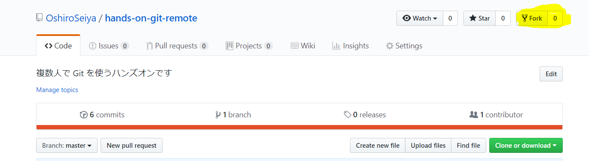

押すと下記のようになりしばらく待ちます。
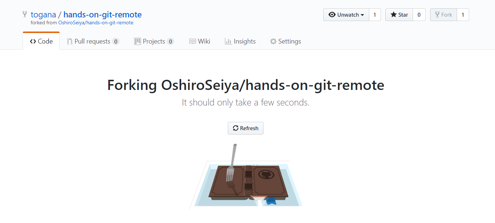

github でやる場合これだけで自分のアカウントに人のコードを持ってくることが完了します。

# ローカル環境に持ってくる

フォークが完了したら自分のローカル環境にクローンします。
※ クローンとは、リモートリポジトリからローカルリポジトリにコピーすることができる機能です。

github desktop のオプションからサインインしてクローンしましょう。

File からオプションを選択します。
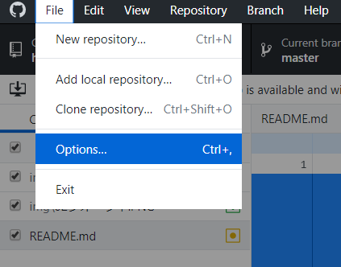

github.comに Sign In を選択します。下記の画面が表示されます。ブラウザから Sign In でも問題ないので Sign In します。
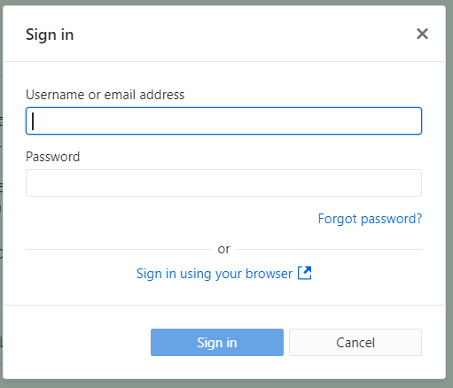

Sign In できたら File から Clone repository を選択します。
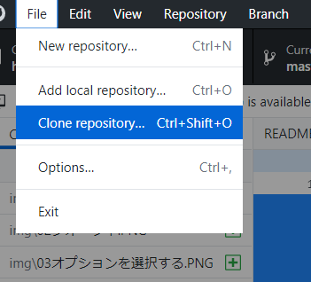

github のリポジトリ一覧が表示されるのでそこから先程フォークしたリポジトリを選択します。
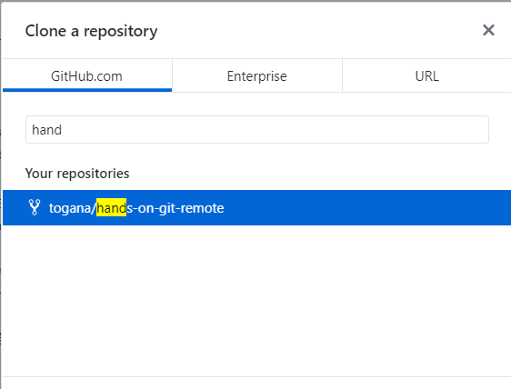

# 編集してプッシュする

下記コミットを参考に名前を追加します。
https://github.com/togana/hands-on-git-remote/commit/4b16fdeae9cd101f7dbb384506011e081db3c436

※ githubのアイコンを参照することができるのでそれを利用して画像を差し込みます。
https://github.com/{github-id}.png

コミットしたら黄色く塗りつぶした Push origin をクリックしてプッシュします。
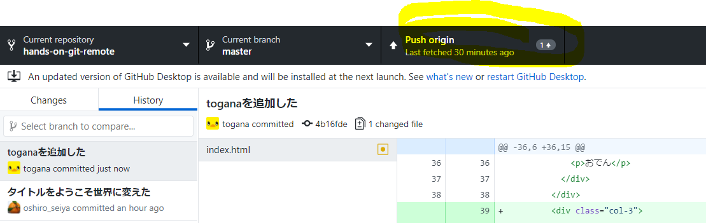

完了したら自分のgithubのリポジトリにアクセスして反映されていることを確認しましょう。
https://github.com/{github-id}/hands-on-git-remote

# プルリクエストを作成する

先程確認した https://github.com/{github-id}/hands-on-git-remote
 からプルリクエストを作成します。

黄色く塗りつぶされた　New pull request をクリックします。
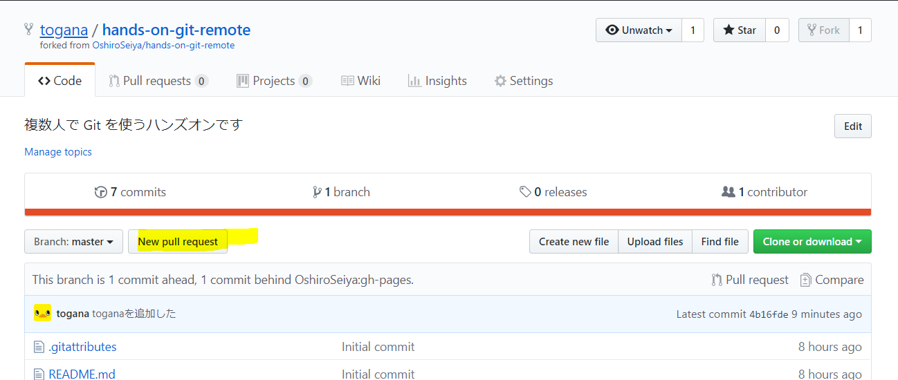

bese fork OshiroSeiya/hands-on-git-remote の gh-pages かつ head fork github-id/handos-ongit-remote になってることを確認して Create pull request をクリックします。
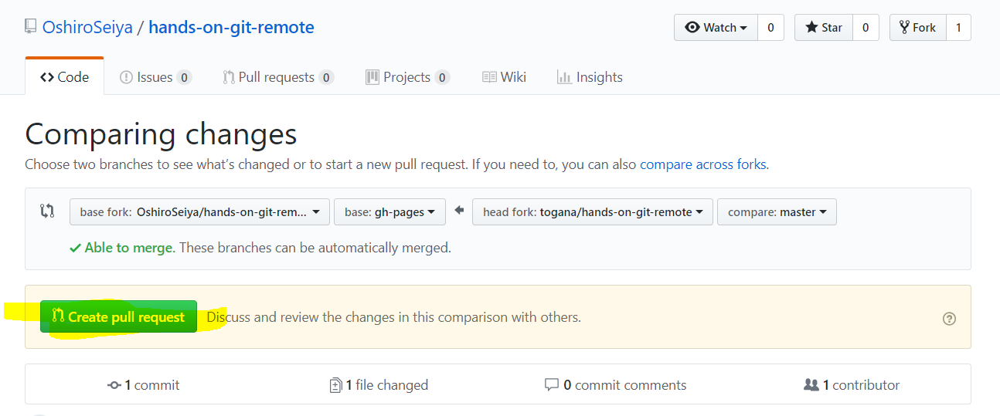

メッセージをかけるのでメッセージをつけて Create pull request をクリックします。
※ ここはプロジェクトによってこれを書いてくださいとかあるときもあるのでガイドとかがある場合はそちらのルールに従ってください。
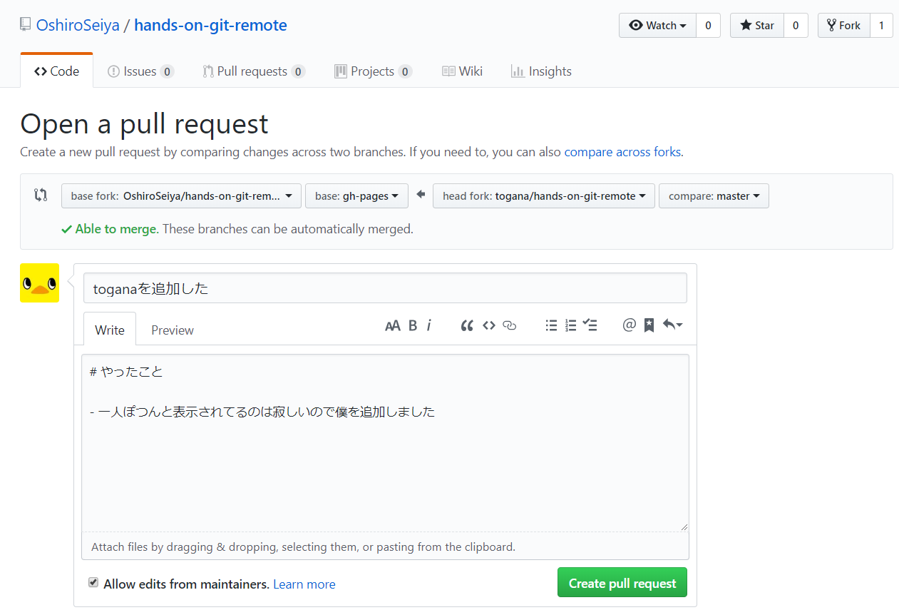

作成が完了すると下記のような画面が表示されます。
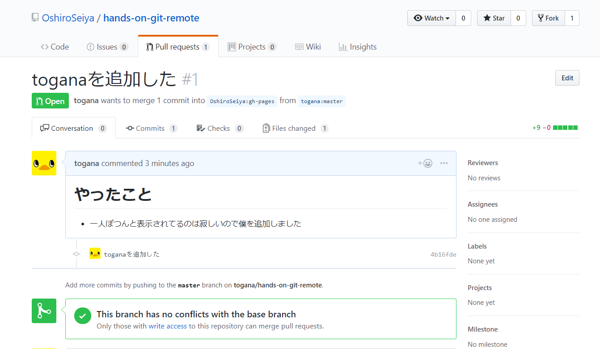

後は僕がマージするのを待つだけです。
※ コンフリクトしてたら✓ではなく☓が表示されるので記載されてる通りに修正してください。

# 発展

もっとデザイン可愛くしたりしてみてください！
そしてPRお待ちしております！！！

時間余った方で上記内容完全に理解したコマンドでやる方法も少しは知りたいという方は下記のサイトがすごく良くできているので試してみるといいかもしれないです。

http://k.swd.cc/learnGitBranching-ja/
